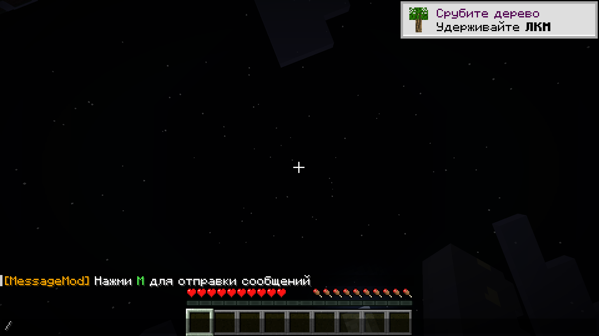
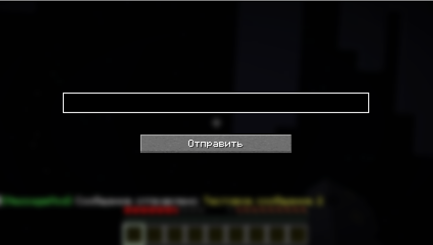
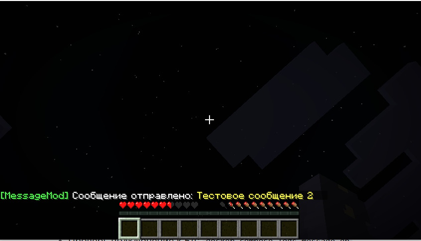
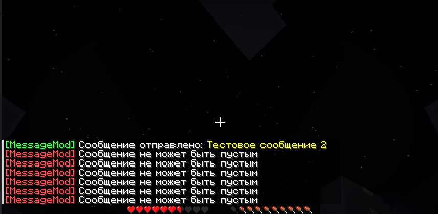
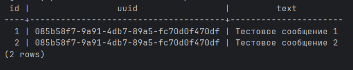

# Message Mod for Minecraft

Fabric мод для отправки сообщений через Protobuf на Spring Boot сервер. Полное тестовое задание с двухкомпонентной архитектурой.

## 📌 Реализованный функционал

### Приветственное сообщение в игре


### GUI для отправки сообщений


### Успешная отправка сообщения


### Валидация ошибок


### Данные в PostgreSQL


## 🕹️ Быстрый запуск

### 1. Запуск сервера
```bash
cd spring-server
docker-compose up -d
```

### Сервер будет доступен на http://localhost:8080

### 2. Сборка мода  
```bash
cd mod
./gradlew build
```

### 3. Установка
- Скопировать message-mod-1.0.0.jar в папку mods
- Запустить Minecraft с Fabric Loader 1.21.8


##  🖱️ Использование
- В игре нажать M

- Ввести сообщение (до 256 символов)

- Нажать "Отправить"

- Увидеть результат в чате

##  🎯 Соответствие ТЗ
### Обязательные требования:
- Fabric мод для Minecraft 1.21.8 

- Gradle 8.14 система сборки 

- Protobuf 3 с официальной Google библиотекой 

- PostgreSQL таблица messages согласно спецификации 

- Hibernate + JPA Repository для работы с БД 

- Mojang mappings - официальные маппинги 

- GUI - использовано стандартное Minecraft API 

##  ⌨️ Проверка работы
### Просмотр сообщений в БД:
```bash
docker-compose exec message-db psql -U message -d message_db -c "SELECT * FROM messages;"
```
Пример результата:
```bash
text
id |                 uuid                  |       text        
----+--------------------------------------+------------------
1 | 085b58f7-9a91-4db7-89a5-fc70d0f470df | Тестовое сообщение 1
2 | 085b58f7-9a91-4db7-89a5-fc70d0f470df | Тестовое сообщение 2
```
Структура таблицы:
```bash
sql
CREATE TABLE messages (
id        SERIAL PRIMARY KEY,
uuid      UUID NOT NULL,
text      VARCHAR(256) NOT NULL
);
```
## ⚙️ Технические детали
### Fabric Mod (fabric-mod/)
- Fabric API 1.21.8 + Fabric Loader 0.17.2

- Protobuf Java 3.25.5 для сериализации

- Mojang Mappings - официальные маппинги

- Java HTTP Client для отправки запросов

- Custom GUI на базе стандартного Minecraft Screen API

### Spring Boot Server (spring-server/)
- Spring Boot 3 + Spring Data JPA

- Hibernate с JPA Repository

- PostgreSQL драйвер

- Protobuf декодирование входящих сообщений

- Общий обработчик ошибок

### Protobuf схема:
```protobuf
message Message {
string text = 1;
}
```


